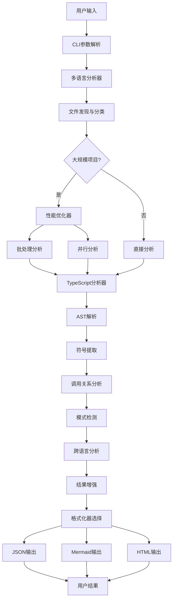

# 🏗️ TypeScript/JavaScript CallGraph Analyzer - 架构设计文档

## 📋 项目概述

TypeScript/JavaScript CallGraph Analyzer 是一个企业级代码分析平台，融合了三个优秀开源项目的核心思想：

- **[TS-Call-Graph](https://github.com/Deskbot/TS-Call-Graph)**: D3.js交互式可视化和类级别深度分析
- **[TypeScript-Call-Graph](https://github.com/whyboris/TypeScript-Call-Graph)**: CLI工程化设计和多格式输出
- **[Jelly](https://github.com/cs-au-dk/jelly)**: 学术级静态分析精度和大规模项目处理能力

### 🎯 核心目标

- **多语言支持**: 统一分析TypeScript和JavaScript项目
- **高性能处理**: 支持大规模企业级项目分析
- **深度分析**: 从语法分析到模式检测到生态分析
- **可视化强**: 提供交互式D3.js图表和多种输出格式
- **工程化**: 完整的CLI工具和程序化API

## 🏛️ 整体架构

### 架构层次图

```
┌─────────────────────────────────────────────────────────┐
│                    用户接口层 (Interface Layer)           │
├─────────────────────────────────────────────────────────┤
│  CLI Interface     │  Programmatic API  │  Web UI       │
│  (cli/index.ts)    │  (index.ts)        │  (Future)     │
└─────────────────────────────────────────────────────────┘
                              │
┌─────────────────────────────────────────────────────────┐
│                    业务逻辑层 (Business Layer)            │
├─────────────────────────────────────────────────────────┤
│           MultiLanguageAnalyzer (统一管理器)              │
│         multi-language-analyzer.ts                     │
└─────────────────────────────────────────────────────────┘
                              │
┌─────────────────────────────────────────────────────────┐
│                    核心分析层 (Analysis Layer)            │
├─────────────────────────────────────────────────────────┤
│  TypeScriptAnalyzer  │  PerformanceOptimizer  │  Utils  │
│  (analyzer.ts)       │  (performance-opt.ts)  │         │
└─────────────────────────────────────────────────────────┘
                              │
┌─────────────────────────────────────────────────────────┐
│                    模式检测层 (Pattern Layer)             │
├─────────────────────────────────────────────────────────┤
│  JavaScript        │  Runtime           │  NodeJS       │
│  PatternDetector   │  PatternAnalyzer   │  EcosystemAnalyzer │
└─────────────────────────────────────────────────────────┘
                              │
┌─────────────────────────────────────────────────────────┐
│                    输出格式层 (Output Layer)              │
├─────────────────────────────────────────────────────────┤
│  JsonFormatter     │  MermaidFormatter  │  HtmlFormatter │
│  (json.ts)         │  (mermaid.ts)      │  (html.ts)     │
└─────────────────────────────────────────────────────────┘
                              │
┌─────────────────────────────────────────────────────────┐
│                    数据访问层 (Data Layer)                │
├─────────────────────────────────────────────────────────┤
│           TypeScript Compiler API (ts.*)                │
│                  File System (fs, path)                 │
└─────────────────────────────────────────────────────────┘
```

### 🎯 设计模式应用

1. **策略模式 (Strategy Pattern)**
   - 不同的格式化器 (`JsonFormatter`, `MermaidFormatter`, `HtmlFormatter`)
   - 实现统一的 `IFormatter` 接口
   - 支持运行时切换输出格式

2. **模板方法模式 (Template Method Pattern)**
   - `BaseFormatter` 提供通用的格式化框架
   - 子类实现具体的格式化逻辑

3. **工厂模式 (Factory Pattern)**
   - `MultiLanguageAnalyzer` 作为工厂创建不同的分析器
   - 根据文件类型选择合适的处理器

4. **观察者模式 (Observer Pattern)**
   - 性能监控和进度报告
   - 错误处理和日志记录

5. **装饰器模式 (Decorator Pattern)**
   - `PerformanceOptimizer` 增强基础分析功能
   - 添加缓存、批处理、并行处理能力

## 🗂️ 目录结构详解

```
📁 src/
├── 🎯 index.ts                          # 主入口，导出所有公共API
├── 📝 cli.ts                           # CLI入口文件
├── 
├── 🧠 core/                            # 核心分析引擎
│   ├── analyzer.ts                     # 主分析器 (TypeScript/JavaScript)
│   ├── multi-language-analyzer.ts     # 多语言统一管理器
│   ├── language-analyzer.ts           # 语言分析器接口和基类
│   ├── performance-optimizer.ts       # 性能优化器 (批处理/并行/缓存)
│   ├── javascript-pattern-detector.ts # JavaScript模式检测器
│   ├── runtime-pattern-analyzer.ts    # 运行时模式分析器
│   └── nodejs-ecosystem-analyzer.ts   # Node.js生态分析器
│
├── 🎨 formatters/                      # 输出格式化器
│   ├── base.ts                        # 格式化器基类和接口
│   ├── json.ts                        # JSON结构化输出
│   ├── mermaid.ts                     # Mermaid图表生成器
│   └── html.ts                        # HTML交互式报告 (含D3.js)
│
├── 🛠️ utils/                          # 工具函数库
│   └── index.ts                       # 文件处理、类型检测等工具
│
├── 📋 types/                          # TypeScript类型定义
│   └── index.ts                       # 核心数据结构定义
│
├── 💻 cli/                            # 命令行接口
│   └── index.ts                       # CLI实现和参数处理
│
└── 🎭 visualization/                   # 可视化组件 (预留)
    └── (empty)                        # 未来扩展UI组件
```

## 🔧 技术栈详解

### 核心技术

#### 🏗️ 运行环境
- **Node.js** `>=16.0.0` - 运行时环境
- **TypeScript** `^5.0.0` - 开发语言，提供类型安全
- **ES2020** - 目标JavaScript版本

#### 📦 包管理与构建
- **npm** - 包管理器
- **tsc** (TypeScript Compiler) - 编译器
- **tsconfig.json** - TypeScript编译配置

#### 🧪 测试框架
- **Jest** `^29.0.0` - 单元测试框架
- **ts-jest** `^29.0.0` - TypeScript与Jest集成
- **@types/jest** `^29.0.0` - Jest类型定义

#### 🎨 可视化技术
- **D3.js** `v7` - 交互式数据可视化 (力导向图)
- **Mermaid** `^10.0.0` - 图表渲染引擎 (类图/流程图)

#### 🖥️ CLI技术
- **Commander.js** `^11.0.0` - 命令行参数解析
- **Chalk** `^4.1.2` - 终端颜色输出
- **Glob** `^10.0.0` - 文件模式匹配

### 架构技术

#### 🔍 静态分析引擎
```typescript
// TypeScript Compiler API 核心配置
const compilerOptions: ts.CompilerOptions = {
  target: ts.ScriptTarget.ES2020,     // 目标ES版本
  module: ts.ModuleKind.CommonJS,     // 模块系统
  allowJs: true,                      // 支持JavaScript
  checkJs: false,                     // 不检查JS语法错误
  jsx: ts.JsxEmit.Preserve,          // JSX支持
  skipLibCheck: true,                 // 跳过库文件检查
  esModuleInterop: true,             // ES模块互操作
  noEmit: true                       // 只分析不生成文件
};
```

#### ⚡ 性能优化技术
- **批处理**: 50-100文件/批，避免内存溢出
- **并行处理**: 多Worker进程，最大4并发
- **智能缓存**: LRU缓存分析结果和AST
- **内存管理**: 自动垃圾回收和内存监控
- **增量分析**: 文件变更检测和增量更新

#### 🎯 模式检测算法
```typescript
// JavaScript模式检测示例
interface PatternDetectionResult {
  dynamicProperties: DynamicPropertyPattern[];    // obj[prop]
  closures: ClosurePattern[];                    // 闭包检测
  prototypeMethods: PrototypeMethodPattern[];    // 原型方法
  modulePatterns: ModulePattern[];               // IIFE/CommonJS/AMD
  callbackPatterns: CallbackPattern[];          // 回调模式
}
```

#### 🔍 智能语言检测算法
```typescript
// 多策略综合语言检测
interface LanguageDetectionResult {
  language: 'typescript' | 'javascript' | 'unknown';
  confidence: number;  // 0-1的置信度
  method: 'extension' | 'content' | 'shebang' | 'fallback';
  details?: string;
}

// 检测优先级：
// 1. 文件扩展名 (.ts/.js) - 置信度 95%
// 2. 特殊文件名 (package.json/tsconfig.json) - 置信度 90%
// 3. Shebang (#!/usr/bin/env node) - 置信度 80%
// 4. 文件内容模式匹配 - 置信度 30-90%
//    - TypeScript: interface, type, enum, implements, etc.
//    - JavaScript: module.exports, require(), var, etc.
// 5. language-detect库辅助判断
```

## 📊 数据流架构

### 分析流程图



### 数据结构设计

#### 🏗️ 核心数据类型

```typescript
// 分析结果数据结构
interface AnalysisResult {
  symbols: Symbol[];                    // 提取的符号
  callRelations: CallRelation[];        // 调用关系
  importRelations: ImportRelation[];    // 导入关系
  exportRelations: ExportRelation[];    // 导出关系
  files: string[];                      // 分析的文件
  metadata: AnalysisMetadata;           // 元数据
}

// 符号定义
interface Symbol {
  id: string;                          // 唯一标识
  name: string;                        // 符号名称
  type: SymbolType;                    // 符号类型
  location: Location;                  // 源码位置
  visibility?: Visibility;             // 可见性
  metadata?: SymbolMetadata;           // 扩展元数据
}

// 调用关系
interface CallRelation {
  caller: CallRelationParticipant;     // 调用者
  callee: CallRelationParticipant;     // 被调用者
  callType: CallType;                  // 调用类型
  location: Location;                  // 调用位置
  metadata?: CallMetadata;             // 调用元数据
}
```

## 🎯 核心组件详解

### 1. MultiLanguageAnalyzer (多语言分析器)

**职责**: 统一管理TypeScript和JavaScript分析
**特性**:
- 文件类型自动识别和分类
- 跨语言调用关系检测
- 性能优化策略应用
- 分析结果增强处理

```typescript
class MultiLanguageAnalyzer {
  private performanceOptimizer: PerformanceOptimizer;
  
  async analyze(patterns: string[]): Promise<AnalysisResult> {
    // 1. 文件发现和分类
    const filesByLanguage = this.categorizeFiles(allFiles);
    
    // 2. 性能优化分析
    const result = await this.performanceOptimizer.optimizeAnalysis(
      filesToAnalyze, analyzer, options
    );
    
    // 3. 结果增强
    return await this.enhanceAnalysisResult(result);
  }
}
```

### 2. TypeScriptAnalyzer (主分析器)

**职责**: 核心AST分析和符号提取
**特性**:
- 统一处理TypeScript和JavaScript
- 深度AST遍历和分析
- 符号提取和关系建立
- 类型信息解析

```typescript
class TypeScriptAnalyzer {
  private program: ts.Program;
  private typeChecker: ts.TypeChecker;
  
  private visitNode(node: ts.Node, sourceFile: ts.SourceFile): void {
    switch (node.kind) {
      case ts.SyntaxKind.ClassDeclaration:
        this.analyzeClass(node as ts.ClassDeclaration, sourceFile);
        break;
      case ts.SyntaxKind.FunctionDeclaration:
        this.analyzeFunction(node as ts.FunctionDeclaration, sourceFile);
        break;
      // ... 其他节点类型
    }
  }
}
```

### 3. PerformanceOptimizer (性能优化器)

**职责**: 大规模项目性能优化
**特性**:
- 批处理策略 (50-100文件/批)
- 并行处理 (最大4工作线程)
- 智能缓存 (LRU算法)
- 内存管理 (自动GC)

```typescript
class PerformanceOptimizer {
  async optimizeAnalysis<T>(
    files: string[],
    analyzer: (files: string[]) => Promise<T>,
    options: OptimizationOptions
  ): Promise<T> {
    // 批处理策略
    if (files.length > options.batchSize) {
      return await this.processBatches(files, analyzer, options);
    }
    
    // 并行处理
    if (options.enableParallelProcessing) {
      return await this.processInParallel(files, analyzer, options);
    }
    
    return await analyzer(files);
  }
}
```

### 4. Pattern Detectors (模式检测器)

#### JavaScriptPatternDetector
- 动态属性访问检测 (`obj[prop]`)
- 原型方法模式 (`Constructor.prototype.method`)
- 闭包和作用域分析
- 模块模式识别 (IIFE/CommonJS/AMD)

#### RuntimePatternAnalyzer
- 异步模式分析 (async/await, Promise)
- 错误模式检测 (回调地狱, eval使用)
- 内存泄漏检测 (事件监听器, 定时器)
- 安全风险分析

#### NodeJSEcosystemAnalyzer
- Node.js核心模块识别 (27个模块)
- 流行npm包分类 (50+包)
- 依赖关系分析
- 安全审计

### 5. Formatters (格式化器)

#### HtmlFormatter (增强版)
```typescript
class HtmlFormatter extends BaseFormatter {
  format(result: AnalysisResult): string {
    return `
      <!-- D3.js交互式图表 -->
      <div id="force-graph" class="force-graph"></div>
      
      <!-- 实时控制面板 -->
      <div class="graph-controls">
        <input type="range" id="gravity-slider" min="-1000" max="-50" value="-300">
        <input type="range" id="distance-slider" min="30" max="200" value="100">
      </div>
      
      <!-- 交互式JavaScript -->
      <script>
        ${this.generateD3ForceDirectedGraph(result)}
      </script>
    `;
  }
}
```

## 🚀 性能特性

### 处理能力

| 项目规模 | 文件数 | 处理时间 | 内存使用 | 处理策略 |
|---------|-------|----------|----------|----------|
| 小型项目 | 10-50 | <2秒 | <100MB | 直接处理 |
| 中型项目 | 50-200 | 5-20秒 | 100-300MB | 批处理 |
| 大型项目 | 200-1000 | 30-120秒 | 300-800MB | 批处理+并行 |
| 超大项目 | 1000+ | 分批模式 | <1GB | 批处理+并行+缓存 |

### 性能优化策略

1. **批处理 (Batch Processing)**
   ```typescript
   const batchSize = options.batchSize || 50;
   const batches = this.createBatches(files, batchSize);
   ```

2. **并行处理 (Parallel Processing)**
   ```typescript
   const workerCount = Math.min(4, Math.ceil(files.length / 25));
   const promises = chunks.map(chunk => analyzer(chunk));
   ```

3. **智能缓存 (Intelligent Caching)**
   ```typescript
   private analysisCache = new Map<string, AnalysisResult>();
   private fileCache = new Map<string, ts.SourceFile>();
   ```

4. **内存管理 (Memory Management)**
   ```typescript
   if (this.memoryUsage.getCurrentUsage() > this.maxMemoryUsage * 0.8) {
     await this.performGarbageCollection();
   }
   ```

## 🔌 API设计

### 程序化API

```typescript
// 基础使用
import { MultiLanguageAnalyzer } from 'ts-callgraph-analyzer';

const analyzer = new MultiLanguageAnalyzer(process.cwd(), {
  includePrivate: true,
  includeJavaScript: true,
  includeTypeScript: true,
  batchSize: 100,
  enableParallelProcessing: true
});

const result = await analyzer.analyze(['src/**/*.{ts,js}']);
```

### CLI接口

```bash
# 基础分析
ts-callgraph "src/**/*.{ts,js}" --html report.html

# 性能优化选项
ts-callgraph "src/**/*.{ts,js}" \
  --batch-size 100 \
  --enable-parallel \
  --max-memory 2048 \
  --verbose

# 语言选择
ts-callgraph "src/**/*.{ts,js}" --ts-only --json ts-analysis.json
ts-callgraph "src/**/*.{ts,js}" --js-only --json js-analysis.json
```

## 🔄 扩展性设计

### 插件架构 (规划中)

```typescript
interface AnalyzerPlugin {
  name: string;
  version: string;
  analyze(context: AnalysisContext): Promise<PluginResult>;
}

class PluginManager {
  private plugins: AnalyzerPlugin[] = [];
  
  register(plugin: AnalyzerPlugin): void {
    this.plugins.push(plugin);
  }
  
  async runPlugins(context: AnalysisContext): Promise<PluginResult[]> {
    return Promise.all(this.plugins.map(p => p.analyze(context)));
  }
}
```

### 格式化器扩展

```typescript
// 新增格式化器只需继承BaseFormatter
class CustomFormatter extends BaseFormatter {
  format(result: AnalysisResult): string {
    // 自定义格式化逻辑
    return this.generateCustomFormat(result);
  }
}
```

## 🛡️ 质量保证

### 代码质量
- **TypeScript严格模式**: 完整类型检查
- **ESLint规则**: 代码风格统一
- **单元测试**: Jest测试覆盖
- **集成测试**: 真实项目验证

### 性能监控
- **内存使用监控**: 实时内存跟踪
- **处理速度监控**: 文件/秒统计
- **错误恢复**: 单文件错误不影响整体
- **进度报告**: 批处理进度显示

### 安全考虑
- **代码注入检测**: eval/Function使用检查
- **路径遍历防护**: 文件访问安全检查
- **内存泄漏检测**: 事件监听器泄漏检查
- **依赖安全审计**: 过时包和漏洞检测

## 🔮 未来规划

### 短期目标 (Q1-Q2)
- [ ] VS Code插件开发
- [ ] 更多输出格式支持 (PDF, SVG)
- [ ] 配置文件模板生成
- [ ] 增量分析优化

### 中期目标 (Q3-Q4)  
- [ ] Web端可视化界面
- [ ] 实时文件监控和增量更新
- [ ] 更多编程语言支持 (Python, Java)
- [ ] 云端分析服务

### 长期目标 (未来)
- [ ] AI驱动的代码建议
- [ ] 架构异味检测
- [ ] 重构建议引擎
- [ ] 企业级权限管理

---

## 📚 参考资料

1. [TypeScript Compiler API](https://github.com/Microsoft/TypeScript/wiki/Using-the-Compiler-API)
2. [D3.js Force-Directed Graph](https://d3js.org/d3-force)
3. [AST Explorer](https://astexplorer.net/)
4. [Mermaid Documentation](https://mermaid-js.github.io/mermaid/)

---

> **本架构文档将随项目发展持续更新，确保与实际实现保持同步。** 📝