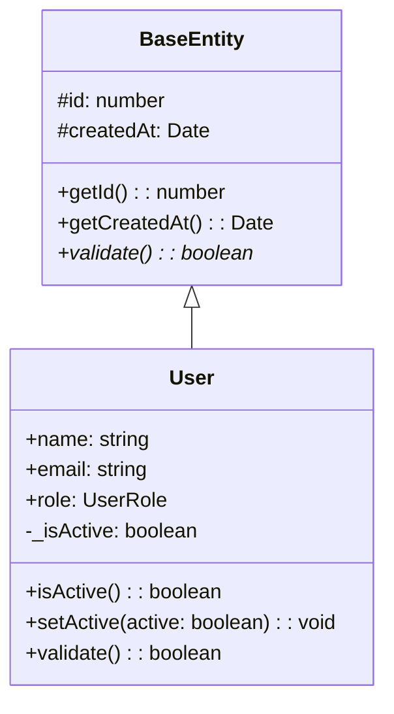

# TypeScript CallGraph Analyzer - 使用示例

## 🚀 快速开始

### 1. 基本分析

```bash
# 分析当前项目的所有TypeScript文件
ts-callgraph src/**/*.ts

# 分析特定文件
ts-callgraph examples/user-management.ts examples/user-service.ts
```

### 2. 生成不同格式的输出

```bash
# JSON格式 - 适合程序化处理
ts-callgraph src/**/*.ts --format json --output analysis.json

# Mermaid格式 - 适合文档和图表
ts-callgraph src/**/*.ts --format mermaid --output diagram.mmd

# HTML格式 - 交互式可视化报告
ts-callgraph src/**/*.ts --format html --output report.html
```

### 3. 同时生成多种格式

```bash
ts-callgraph src/**/*.ts \
  --json analysis.json \
  --mermaid diagram.mmd \
  --html report.html
```

### 4. 高级选项

```bash
# 包含私有成员和详细输出
ts-callgraph src/**/*.ts \
  --include-private \
  --follow-imports \
  --verbose \
  --html detailed-report.html

# 自定义排除模式
ts-callgraph src/**/*.ts \
  --exclude "**/*.test.ts,**/*.spec.ts,**/node_modules/**" \
  --max-depth 5
```

## 📊 输出示例

### JSON输出结构
```json
{
  "symbols": [
    {
      "id": "User_user-management.ts_25_14",
      "name": "User", 
      "type": "class",
      "location": {
        "filePath": "/path/to/user-management.ts",
        "start": { "line": 25, "column": 14 },
        "end": { "line": 67, "column": 1 }
      },
      "extends": ["BaseEntity"],
      "implements": ["IUser"],
      "methods": [...],
      "properties": [...]
    }
  ],
  "callRelations": [
    {
      "caller": "constructor",
      "callee": "super", 
      "callType": "constructor",
      "location": { ... }
    }
  ],
  "importRelations": [...],
  "metadata": {
    "analysisDate": "2025-09-09T08:12:51.603Z",
    "totalFiles": 2,
    "totalSymbols": 30,
    "totalCallRelations": 48
  }
}
```

### Mermaid类图示例


### HTML报告功能
- 📈 项目统计概览
- 🔍 可搜索的符号表
- 🕸️ 交互式调用关系图
- 📋 导入依赖关系表
- 🎨 动态类图可视化

## 🧩 程序化使用

```typescript
import { 
  TypeScriptAnalyzer, 
  JsonFormatter, 
  HtmlFormatter,
  MermaidFormatter 
} from 'ts-callgraph-analyzer';

// 创建分析器
const analyzer = new TypeScriptAnalyzer(process.cwd(), {
  includePrivate: true,
  followImports: true,
  maxDepth: 10
});

// 执行分析
const result = await analyzer.analyze(['src/**/*.ts']);

// 使用不同的格式化器
const jsonFormatter = new JsonFormatter();
const htmlFormatter = new HtmlFormatter(); 
const mermaidFormatter = new MermaidFormatter();

// 输出结果
console.log('JSON:', jsonFormatter.format(result));
fs.writeFileSync('report.html', htmlFormatter.format(result));
fs.writeFileSync('diagram.mmd', mermaidFormatter.format(result));
```

## 🎯 实际应用场景

### 1. 代码审查和重构
```bash
# 分析代码复杂度和依赖关系
ts-callgraph src/**/*.ts --html code-review.html --include-private
```

### 2. 架构文档生成
```bash
# 生成系统架构图
ts-callgraph src/**/*.ts --mermaid architecture.mmd
```

### 3. 依赖关系分析
```bash
# 分析模块间的导入导出关系
ts-callgraph src/**/*.ts --json dependencies.json --follow-imports
```

### 4. 新人代码导读
```bash
# 生成交互式代码导读页面
ts-callgraph src/**/*.ts --html onboarding.html --verbose
```

## 📈 分析结果解读

### 符号类型说明
- **class**: 类定义
- **interface**: 接口定义  
- **function**: 函数定义
- **method**: 类方法
- **property**: 类属性
- **variable**: 变量声明

### 调用关系类型
- **method**: 方法调用 (obj.method())
- **function**: 函数调用 (func())
- **constructor**: 构造函数调用 (new Class())
- **property**: 属性访问 (obj.prop)

### 导入关系类型  
- **default**: 默认导入 (import X from 'module')
- **named**: 命名导入 (import {X} from 'module')
- **namespace**: 命名空间导入 (import * as X from 'module')
- **sideEffect**: 副作用导入 (import 'module')

## 🔧 常见问题

### Q: 如何排除测试文件？
```bash
ts-callgraph src/**/*.ts --exclude "**/*.test.ts,**/*.spec.ts"
```

### Q: 如何分析包含d.ts文件？
```bash
ts-callgraph src/**/*.ts --exclude ""
```

### Q: 如何分析node_modules？
```bash
ts-callgraph src/**/*.ts --include-node-modules
```

### Q: 分析大项目时内存不足？
```bash
ts-callgraph src/**/*.ts --max-depth 3
```

## 📞 获取帮助

```bash
# 查看所有选项
ts-callgraph --help

# 查看子命令帮助
ts-callgraph analyze --help
ts-callgraph visualize --help
```

---

更多详细信息请参考 [README.md](./README.md) 文档。