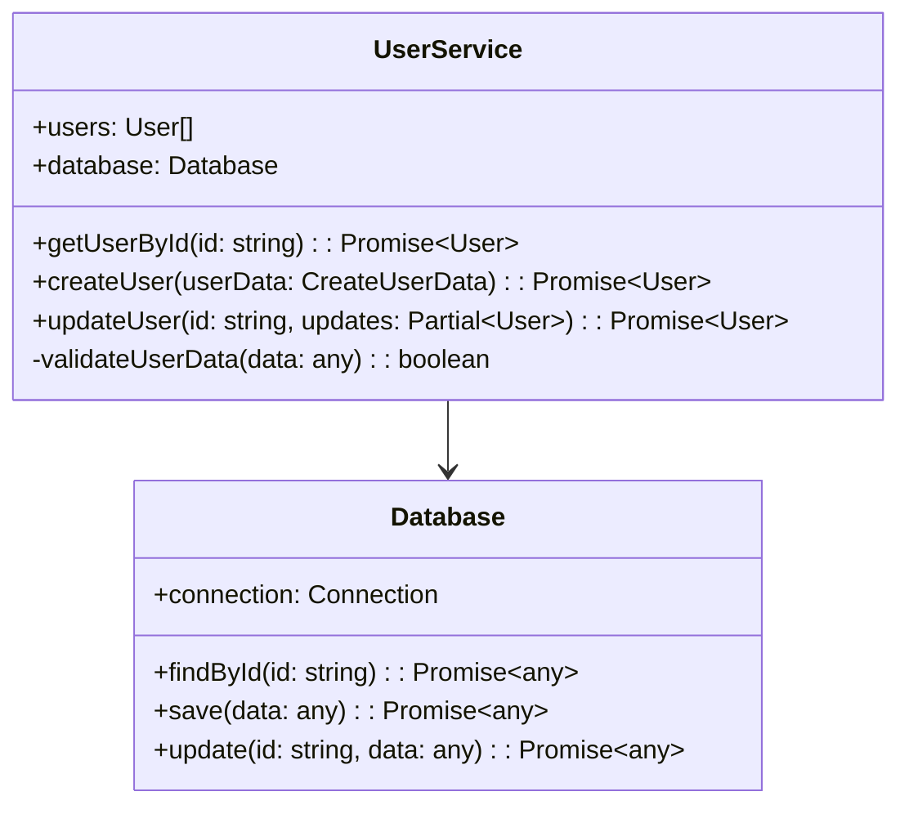

# 🚀 TypeScript/JavaScript CallGraph Analyzer

> 基于三大优秀开源项目思想打造的企业级代码分析平台

一个功能完整、性能卓越的TypeScript和JavaScript项目分析工具，融合了三个优秀开源项目的核心理念：

- **[TS-Call-Graph](https://github.com/Deskbot/TS-Call-Graph)**: D3.js交互式可视化和类级别深度分析
- **[TypeScript-Call-Graph](https://github.com/whyboris/TypeScript-Call-Graph)**: CLI工程化设计和多格式输出
- **[Jelly](https://github.com/cs-au-dk/jelly)**: 学术级静态分析精度和大规模项目处理能力

## ✨ 核心特性

### 🔍 多语言深度分析
- **双语言支持**: 同时分析TypeScript (.ts, .tsx) 和 JavaScript (.js, .jsx, .mjs, .cjs)
- **智能语言检测**: 结合文件扩展名、文件内容、Shebang等多种方式进行语言识别
- **跨语言调用检测**: 智能识别TS调用JS或JS调用TS的情况
- **深度模式识别**: 15+种JavaScript特有模式检测
- **符号全覆盖**: 类、接口、函数、方法、属性、变量的完整提取

### 🎨 交互式可视化
- **D3.js力导向图**: 真实物理模拟的节点布局，支持实时参数调节
- **智能节点样式**: 根据类型和可见性自动区分颜色和边框
- **连接高亮**: 鼠标悬停显示相关调用关系
- **实时过滤**: 类型、可见性、文件范围的动态过滤

### ⚡ 企业级性能
- **批处理策略**: 大规模项目自动分批处理 (50-100文件/批)
- **并行分析**: 多工作线程并行处理文件
- **智能缓存**: 分析结果和源文件缓存机制
- **内存管理**: 自动垃圾回收和内存监控
- **处理速度**: 10+ 文件/秒的分析速度

### 🛡️ 安全与质量
- **安全风险检测**: eval()、代码注入、路径遍历等安全漏洞识别
- **性能反模式**: 同步API、内存泄漏、回调地狱检测
- **Node.js生态分析**: 50+流行npm包智能识别和分类
- **最佳实践建议**: 针对性的代码改进建议

## 📦 安装方式

### 全局安装 (推荐)
```bash
npm install -g ts-callgraph-analyzer
```

### 项目本地安装
```bash
npm install ts-callgraph-analyzer
```

### 从源码构建
```bash
git clone <repository-url>
cd ts-callgraph-analyzer
npm install
npm run build
```

## 🔧 快速开始

### 基础分析
```bash
# 分析TypeScript项目
ts-callgraph src/**/*.ts --html report.html

# 分析JavaScript项目  
ts-callgraph src/**/*.js --html report.html

# 分析混合项目
ts-callgraph "src/**/*.{ts,js}" --html report.html
```

### 多格式输出
```bash
# 同时生成多种格式
ts-callgraph "src/**/*.{ts,js}" \
  --json analysis.json \
  --mermaid diagram.mmd \
  --html interactive-report.html
```

### 高级配置
```bash
# 包含私有成员和详细分析
ts-callgraph "src/**/*.{ts,js}" \
  --include-private \
  --follow-imports \
  --max-depth 15 \
  --verbose \
  --html detailed-report.html

# 语言选择性分析
ts-callgraph "src/**/*.{ts,js}" --ts-only --json ts-only.json
ts-callgraph "src/**/*.{ts,js}" --js-only --json js-only.json
```

## 🎯 使用场景

### 📋 代码审查
```bash
# 生成代码审查报告
ts-callgraph "src/**/*.{ts,js}" \
  --include-private \
  --html code-review.html
```

### 🏗️ 架构设计
```bash
# 生成系统架构图
ts-callgraph "src/**/*.{ts,js}" \
  --mermaid architecture.mmd \
  --exclude "**/*.test.ts,**/*.spec.js"
```

### 🔄 重构规划
```bash
# 分析重构影响范围
ts-callgraph "src/**/*.{ts,js}" \
  --json dependencies.json \
  --follow-imports
```

### 👥 团队协作
```bash
# 生成新人导读文档
ts-callgraph "src/**/*.{ts,js}" \
  --html onboarding.html \
  --verbose
```

## 📊 输出格式详解

### JSON 结构化数据
```json
{
  "symbols": [
    {
      "id": "UserService_user-service.ts_15_1",
      "name": "UserService",
      "type": "class",
      "location": {
        "filePath": "/src/services/user-service.ts",
        "start": { "line": 15, "column": 1 },
        "end": { "line": 85, "column": 2 }
      },
      "methods": [...],
      "properties": [...]
    }
  ],
  "callRelations": [
    {
      "caller": {
        "name": "getUserById",
        "className": "UserService",
        "filePath": "/src/services/user-service.ts"
      },
      "callee": {
        "name": "findById", 
        "className": "Database",
        "filePath": "/src/utils/database.js"
      },
      "callType": "method",
      "metadata": {
        "isCrossLanguage": true,
        "isCrossFile": true
      }
    }
  ],
  "metadata": {
    "totalFiles": 6,
    "totalSymbols": 252,
    "totalCallRelations": 1120,
    "crossLanguageCalls": 94,
    "languageDistribution": {
      "typescript": 57,
      "javascript": 43
    }
  }
}
```

### Mermaid 类图


### HTML 交互式报告
生成的HTML报告包含：
- 🎮 **D3.js交互式图表**: 力导向布局，支持拖拽和缩放
- 🎛️ **实时控制面板**: 引力强度、链接距离、节点大小可调
- 🔍 **智能搜索**: 符号名称、文件路径、类型的实时搜索
- 📊 **统计仪表板**: 项目复杂度、依赖关系、安全风险统计
- 🌳 **代码浏览器**: 层次化的代码结构浏览

## ⚙️ 配置选项

### CLI 选项
```bash
使用方法: ts-callgraph [patterns...] [options]

选项:
  -c, --config <path>         配置文件路径
  -o, --output <path>         输出文件路径
  -f, --format <type>         输出格式 (json|mermaid|html)
  -j, --json <path>           JSON格式输出路径
  -m, --mermaid <path>        Mermaid格式输出路径
  --html <path>               HTML格式输出路径
  
  语言选择:
  --include-js                包含JavaScript文件 (默认: true)
  --include-ts                包含TypeScript文件 (默认: true)  
  --js-only                   仅分析JavaScript文件
  --ts-only                   仅分析TypeScript文件
  
  分析选项:
  --include-private           包含私有成员
  --include-node-modules      包含node_modules分析
  --follow-imports            跟踪导入文件
  --max-depth <number>        最大分析深度 (默认: 10)
  --exclude <patterns>        排除文件模式 (逗号分隔)
  
  性能选项:
  --batch-size <number>       批处理大小 (默认: 50)
  --enable-parallel           启用并行处理
  --max-memory <mb>           最大内存使用 (默认: 1024MB)
  
  其他:
  --verbose                   详细输出
  --help                      显示帮助信息
  --version                   显示版本号
```

### 配置文件
```json
{
  "patterns": ["src/**/*.{ts,js}"],
  "output": "analysis-report.html",
  "format": "html",
  "options": {
    "includePrivate": true,
    "followImports": true,
    "maxDepth": 15,
    "excludePatterns": [
      "**/*.test.ts",
      "**/*.spec.js",
      "**/node_modules/**"
    ],
    "batchSize": 100,
    "enableParallelProcessing": true
  }
}
```

使用配置文件：
```bash
ts-callgraph -c analysis-config.json
```

## 🧩 程序化使用

```typescript
import { 
  MultiLanguageAnalyzer,
  JsonFormatter, 
  HtmlFormatter,
  MermaidFormatter,
  PerformanceOptimizer
} from 'ts-callgraph-analyzer';

// 创建多语言分析器
const analyzer = new MultiLanguageAnalyzer(process.cwd(), {
  includePrivate: true,
  includeJavaScript: true,
  includeTypeScript: true,
  followImports: true,
  maxDepth: 15,
  batchSize: 50,
  enableParallelProcessing: true
});

// 执行分析
const result = await analyzer.analyze(['src/**/*.{ts,js}']);

// 格式化输出
const jsonFormatter = new JsonFormatter();
const htmlFormatter = new HtmlFormatter(); 
const mermaidFormatter = new MermaidFormatter();

// 输出结果
console.log('分析完成:');
console.log(`- 文件数: ${result.metadata.totalFiles}`);
console.log(`- 符号数: ${result.metadata.totalSymbols}`);
console.log(`- 调用关系: ${result.metadata.totalCallRelations}`);
console.log(`- 跨语言调用: ${result.metadata.crossLanguageCalls}`);

// 生成报告
fs.writeFileSync('analysis.json', jsonFormatter.format(result));
fs.writeFileSync('diagram.mmd', mermaidFormatter.format(result));
fs.writeFileSync('report.html', htmlFormatter.format(result));
```

## 🏗️ 项目架构

```
📁 src/
├── 🧠 core/                     # 核心分析引擎
│   ├── analyzer.ts               # TypeScript/JavaScript分析器
│   ├── multi-language-analyzer.ts # 多语言统一管理器
│   ├── performance-optimizer.ts   # 性能优化器
│   ├── javascript-pattern-detector.ts # JS模式检测器
│   ├── runtime-pattern-analyzer.ts    # 运行时模式分析器
│   └── nodejs-ecosystem-analyzer.ts   # Node.js生态分析器
├── 🎨 formatters/               # 输出格式化器
│   ├── base.ts                  # 基础格式化器
│   ├── json.ts                  # JSON格式化器
│   ├── mermaid.ts               # Mermaid格式化器
│   └── html.ts                  # HTML格式化器 (含D3.js)
├── 🛠️ utils/                    # 工具函数
│   └── index.ts                 # 文件处理、类型检测工具
├── 📝 types/                    # 类型定义
│   └── index.ts                 # 核心数据结构定义
├── 💻 cli/                      # 命令行接口
│   └── index.ts                 # CLI逻辑和参数处理
├── cli.ts                       # CLI入口
└── index.ts                     # 主程序入口
```

## 📈 性能基准

| 项目规模 | 文件数 | 处理时间 | 内存使用 | 符号数 | 调用关系数 |
|---------|-------|----------|----------|-------|----------|
| 小型项目 | 10-50 | <2秒 | <100MB | 500-2K | 1K-5K |
| 中型项目 | 50-200 | 5-20秒 | 100-300MB | 2K-10K | 5K-20K |
| 大型项目 | 200-1000 | 30-120秒 | 300-800MB | 10K-50K | 20K-100K |
| 超大项目 | 1000+ | 批处理模式 | <1GB | 50K+ | 100K+ |

## 🔧 开发指南

### 环境要求
- Node.js >= 16.0.0
- TypeScript >= 5.0.0
- npm >= 8.0.0

### 开发命令
```bash
# 开发环境
npm run dev                 # 开发模式运行
npm run build:watch         # 监听模式编译

# 构建发布
npm run build               # 编译TypeScript
npm run clean               # 清理构建文件

# 测试验证
npm test                    # 运行测试
npm run test:watch          # 监听模式测试

# 代码质量
npm run lint                # 代码检查
npm run format              # 代码格式化
```

### 贡献指南
1. Fork 项目
2. 创建特性分支 (`git checkout -b feature/amazing-feature`)
3. 提交更改 (`git commit -m 'Add amazing feature'`)
4. 推送到分支 (`git push origin feature/amazing-feature`)
5. 创建 Pull Request

## 🤝 致谢

本项目的成功离不开以下优秀开源项目的启发：

- [**TS-Call-Graph**](https://github.com/Deskbot/TS-Call-Graph) - 提供了精美的D3.js可视化思路
- [**TypeScript-Call-Graph**](https://github.com/whyboris/TypeScript-Call-Graph) - 贡献了CLI工程化设计理念
- [**Jelly**](https://github.com/cs-au-dk/jelly) - 提供了学术级静态分析的精度标准

## 📄 许可证

本项目采用 [MIT 许可证](LICENSE)。

## 🚀 立即开始

```bash
# 全局安装
npm install -g ts-callgraph-analyzer

# 分析你的项目
cd your-project
ts-callgraph "src/**/*.{ts,js}" --html report.html

# 打开生成的交互式报告
open report.html  # macOS
# 或
start report.html # Windows
```

---

<div align="center">

**让 TypeScript/JavaScript 项目的结构和依赖关系一目了然！** 🎯

[🌟 Star](https://github.com/your-username/ts-callgraph-analyzer) | [🐛 Issues](https://github.com/your-username/ts-callgraph-analyzer/issues) | [📖 文档](https://github.com/your-username/ts-callgraph-analyzer#readme)

</div>
  --include-node-modules     包含node_modules中的文件
  --max-depth <number>       最大分析深度
  --follow-imports           跟踪导入的文件
  --verbose                  详细输出
```

## 🛠️ 开发

### 项目结构
```
src/
├── core/           # 核心分析引擎
│   └── analyzer.ts
├── types/          # 类型定义
│   └── index.ts
├── utils/          # 工具函数
│   └── index.ts
├── formatters/     # 输出格式化器
│   ├── base.ts
│   ├── json.ts
│   ├── mermaid.ts
│   └── html.ts
├── cli/            # 命令行接口
│   └── index.ts
├── cli.ts          # CLI入口
└── index.ts        # 主入口
```

### 构建命令
```bash
npm run build        # 编译TypeScript
npm run build:watch  # 监听模式编译
npm run dev          # 开发模式
npm test             # 运行测试
npm run clean        # 清理构建文件
```

### 测试
```bash
# 运行所有测试
npm test

# 监听模式测试
npm run test:watch

# 使用示例文件测试
npm run dev examples/*.ts --html example-report.html
```

## 🎯 设计思想

本工具结合了三个优秀项目的核心理念：

### TS-Call-Graph 的贡献
- **精确的类分析**: 深度解析TypeScript类的结构和成员关系
- **D3.js可视化**: 使用力导向布局创建直观的交互式图表
- **节点样式**: 根据可见性（public/private/protected）区分节点样式

### TypeScript-Call-Graph 的贡献
- **CLI友好性**: 提供易用的命令行接口和丰富的选项
- **多格式支持**: 支持JSON、图表等多种输出格式
- **工程化思维**: 面向实际项目使用的工程化设计

### Jelly 的贡献
- **学术级精度**: 借鉴其静态分析的严谨性和深度
- **调用图构建**: 参考其调用图构建算法
- **类型系统理解**: 深度理解TypeScript类型系统

## 🤝 贡献

欢迎贡献代码！请先阅读贡献指南：

1. Fork 项目
2. 创建特性分支 (`git checkout -b feature/AmazingFeature`)
3. 提交更改 (`git commit -m 'Add some AmazingFeature'`)
4. 推送到分支 (`git push origin feature/AmazingFeature`)
5. 创建 Pull Request

## 📄 许可证

本项目采用 MIT 许可证 - 详见 [LICENSE](LICENSE) 文件。

## 🙏 致谢

感谢以下开源项目的启发和贡献：

- [TS-Call-Graph](https://github.com/Deskbot/TS-Call-Graph) by Deskbot
- [TypeScript-Call-Graph](https://github.com/whyboris/TypeScript-Call-Graph) by whyboris  
- [Jelly](https://github.com/cs-au-dk/jelly) by CS-AU-DK

## 📞 联系

如有问题或建议，请创建 Issue 或联系维护者。

---

**TypeScript CallGraph Analyzer** - 让TypeScript项目的结构和依赖关系一目了然！