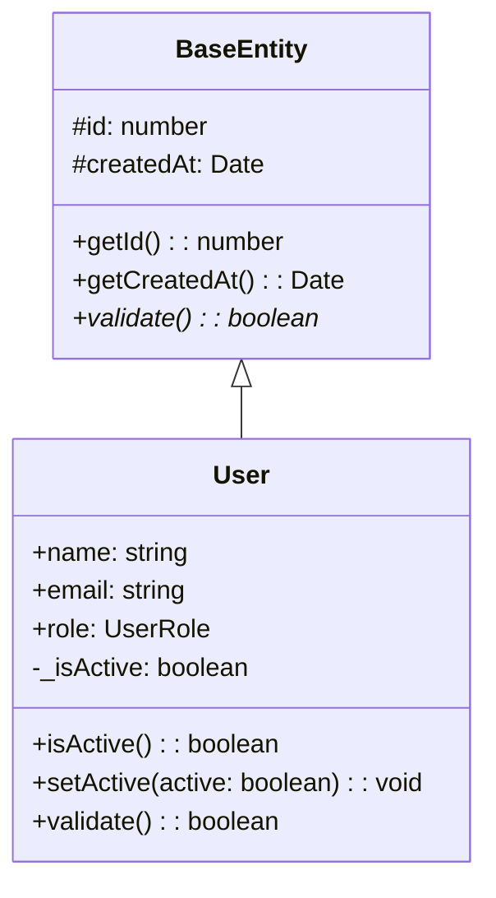

# TypeScript CallGraph Analyzer

一个强大的TypeScript工程分析工具，结合了三个优秀开源项目的思想和特性：

- **[TS-Call-Graph](https://github.com/Deskbot/TS-Call-Graph)**: 类的可视化分析和D3.js交互式图表
- **[TypeScript-Call-Graph](https://github.com/whyboris/TypeScript-Call-Graph)**: CLI工具和多种可视化方式
- **[Jelly](https://github.com/cs-au-dk/jelly)**: 学术级静态分析和深度代码理解

## 🚀 功能特性

### 核心分析功能
- **符号提取**: 类、接口、函数、方法、属性、变量的全面提取
- **调用关系分析**: 函数调用、方法调用、构造函数调用的精确追踪
- **依赖关系分析**: import/export关系的完整映射
- **类型信息**: TypeScript类型系统的深度理解

### 多种输出格式
- **JSON**: 结构化数据输出，便于进一步处理
- **Mermaid**: 生成标准Mermaid图表代码
- **HTML**: 交互式可视化报告，支持搜索和过滤

### 交互式可视化
- **调用图**: D3.js力导向布局的动态调用关系图
- **类图**: Mermaid渲染的UML风格类图
- **统计面板**: 项目结构的详细统计信息
- **搜索过滤**: 实时搜索和多维度过滤

## 📦 安装

### 全局安装
```bash
npm install -g ts-callgraph-analyzer
```

### 本地安装
```bash
npm install ts-callgraph-analyzer
```

### 从源码构建
```bash
git clone <repository-url>
cd ts-callgraph-analyzer
npm install
npm run build
```

## 🔧 使用方法

### 命令行使用

#### 基础分析
```bash
# 分析当前目录下的所有TypeScript文件
ts-callgraph src/**/*.ts

# 分析特定文件
ts-callgraph src/index.ts src/utils/*.ts

# 指定输出格式和文件
ts-callgraph src/**/*.ts --format json --output analysis.json
```

#### 多格式输出
```bash
# 同时生成多种格式
ts-callgraph src/**/*.ts \
  --json analysis.json \
  --mermaid callgraph.mmd \
  --html report.html
```

#### 高级选项
```bash
# 包含私有成员和node_modules
ts-callgraph src/**/*.ts \
  --include-private \
  --include-node-modules \
  --follow-imports

# 自定义排除模式
ts-callgraph src/**/*.ts \
  --exclude "**/*.test.ts,**/*.spec.ts" \
  --max-depth 5 \
  --verbose
```

### 程序化使用

```typescript
import { TypeScriptAnalyzer, JsonFormatter, HtmlFormatter } from 'ts-callgraph-analyzer';

// 创建分析器
const analyzer = new TypeScriptAnalyzer(process.cwd(), {
  includePrivate: true,
  followImports: true,
  maxDepth: 10
});

// 执行分析
const result = await analyzer.analyze(['src/**/*.ts']);

// 格式化输出
const jsonFormatter = new JsonFormatter();
const htmlFormatter = new HtmlFormatter();

console.log(jsonFormatter.format(result));
fs.writeFileSync('report.html', htmlFormatter.format(result));
```

## 📊 输出示例

### JSON格式
```json
{
  "symbols": [
    {
      "id": "User_user-management.ts_25_14",
      "name": "User",
      "type": "class",
      "location": {
        "filePath": "/path/to/user-management.ts",
        "start": { "line": 25, "column": 14 },
        "end": { "line": 67, "column": 1 }
      },
      "isExported": true,
      "extends": ["BaseEntity"],
      "implements": ["IUser"],
      "methods": [
        {
          "name": "isActive",
          "type": "method",
          "accessibility": "public",
          "returnType": "boolean"
        }
      ]
    }
  ],
  "callRelations": [
    {
      "caller": "constructor",
      "callee": "super",
      "callType": "constructor",
      "location": { /* ... */ }
    }
  ]
}
```

### Mermaid类图


### HTML报告
生成的HTML报告包含：
- 📈 项目统计概览
- 🔍 可搜索的符号表
- 🕸️ 交互式调用关系图
- 📋 导入依赖关系表
- 🎨 动态类图可视化

## ⚙️ 配置选项

### 分析选项
- `includePrivate`: 是否包含私有成员 (默认: false)
- `includeNodeModules`: 是否分析node_modules (默认: false)
- `maxDepth`: 最大分析深度 (默认: 10)
- `excludePatterns`: 排除文件模式 (默认: ['node_modules/**', '**/*.d.ts'])
- `followImports`: 是否跟踪导入文件 (默认: false)

### CLI选项
```bash
Options:
  -o, --output <path>        输出文件路径
  -f, --format <type>        输出格式 (json|mermaid|html)
  -j, --json <path>          JSON格式输出路径
  -m, --mermaid <path>       Mermaid格式输出路径
  -h, --html <path>          HTML格式输出路径
  --exclude <patterns>       排除的文件模式，逗号分隔
  --include-private          包含私有成员
  --include-node-modules     包含node_modules中的文件
  --max-depth <number>       最大分析深度
  --follow-imports           跟踪导入的文件
  --verbose                  详细输出
```

## 🛠️ 开发

### 项目结构
```
src/
├── core/           # 核心分析引擎
│   └── analyzer.ts
├── types/          # 类型定义
│   └── index.ts
├── utils/          # 工具函数
│   └── index.ts
├── formatters/     # 输出格式化器
│   ├── base.ts
│   ├── json.ts
│   ├── mermaid.ts
│   └── html.ts
├── cli/            # 命令行接口
│   └── index.ts
├── cli.ts          # CLI入口
└── index.ts        # 主入口
```

### 构建命令
```bash
npm run build        # 编译TypeScript
npm run build:watch  # 监听模式编译
npm run dev          # 开发模式
npm test             # 运行测试
npm run clean        # 清理构建文件
```

### 测试
```bash
# 运行所有测试
npm test

# 监听模式测试
npm run test:watch

# 使用示例文件测试
npm run dev examples/*.ts --html example-report.html
```

## 🎯 设计思想

本工具结合了三个优秀项目的核心理念：

### TS-Call-Graph 的贡献
- **精确的类分析**: 深度解析TypeScript类的结构和成员关系
- **D3.js可视化**: 使用力导向布局创建直观的交互式图表
- **节点样式**: 根据可见性（public/private/protected）区分节点样式

### TypeScript-Call-Graph 的贡献
- **CLI友好性**: 提供易用的命令行接口和丰富的选项
- **多格式支持**: 支持JSON、图表等多种输出格式
- **工程化思维**: 面向实际项目使用的工程化设计

### Jelly 的贡献
- **学术级精度**: 借鉴其静态分析的严谨性和深度
- **调用图构建**: 参考其调用图构建算法
- **类型系统理解**: 深度理解TypeScript类型系统

## 🤝 贡献

欢迎贡献代码！请先阅读贡献指南：

1. Fork 项目
2. 创建特性分支 (`git checkout -b feature/AmazingFeature`)
3. 提交更改 (`git commit -m 'Add some AmazingFeature'`)
4. 推送到分支 (`git push origin feature/AmazingFeature`)
5. 创建 Pull Request

## 📄 许可证

本项目采用 MIT 许可证 - 详见 [LICENSE](LICENSE) 文件。

## 🙏 致谢

感谢以下开源项目的启发和贡献：

- [TS-Call-Graph](https://github.com/Deskbot/TS-Call-Graph) by Deskbot
- [TypeScript-Call-Graph](https://github.com/whyboris/TypeScript-Call-Graph) by whyboris  
- [Jelly](https://github.com/cs-au-dk/jelly) by CS-AU-DK

## 📞 联系

如有问题或建议，请创建 Issue 或联系维护者。

---

**TypeScript CallGraph Analyzer** - 让TypeScript项目的结构和依赖关系一目了然！